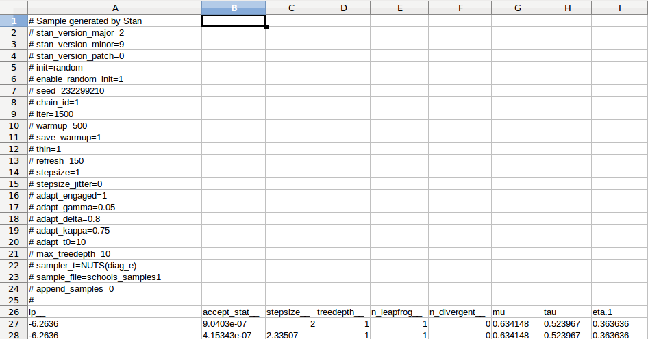
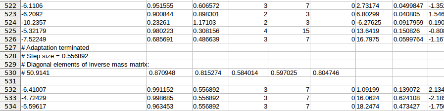

```{r setup, include=FALSE}
knitr::opts_chunk$set(echo = TRUE, collapse=TRUE)
library(magrittr)
library(rstan)
```

This article exposes several ways to extract the samples generated by STAN with the `rstan` package.


## Running STAN

We will use the following example of STAN model.

```{r stanmodel, message=FALSE, warning=FALSE, cache=TRUE}
# load rstan package and set options
library(rstan)
rstan_options(auto_write = TRUE)
options(mc.cores = parallel::detectCores())

# stan model
stancode <- 'data {
  int<lower=0> J; // number of schools 
  real y[J]; // estimated treatment effects
  real<lower=0> sigma[J]; // s.e. of effect estimates 
}
parameters {
  real mu; 
  real<lower=0> tau;
  real eta[J];
}
transformed parameters {
  real theta[J];
  for (j in 1:J)
    theta[j] = mu + tau * eta[j];
  }
model {
  eta ~ normal(0, 1);
  y ~ normal(theta, sigma);
}'

# compile model  
stanmodel <- stan_model(model_code = stancode, model_name="schools")

# stan data 
standata <- list(J = 4, 
                 y = c(28,  8, -3,  7), 
                 sigma = c(15, 10, 16, 11))
```

```{r samples, include=FALSE}
samples <- sampling(stanmodel, data = standata, 
                    iter = 1500, warmup = 500, chains = 4,
                    sample_file=sprintf("%s_samples", stanmodel@model_name))
```


The STAN sampler is run by the `sampling` function of the `rstan` package:

```{r, eval=FALSE}
samples <- sampling(stanmodel, data = standata, 
                    iter = 1500, warmup = 500, chains = 4)
```

This generates  a `stanfit` object:

```{r}
class(samples)
```

One can chose to store the samples in CSV files (one for each chain) by providing a character string to the `sample_file` option:

```{r, eval=FALSE}
samples <- sampling(stanmodel, data = standata, 
                    iter = 1500, warmup = 500, chains = 4,
                    sample_file=sprintf("%s_samples", stanmodel@model_name))
```

Since I gave the name `"schools"` to the model, the above code generates four CSV files named  `schools_samples1.csv`, ..., `schools_samples4.csv`.


## Getting the samples from the `stanfit` object 

### From `stanfit` to `mcmc.list` 

The `extract` function of the `rstan` package gives a three-dimensional array when it is used 
with the option `permuted=FALSE`:

```{r extractsamples}
rstan::extract(samples, pars=c("mu", "tau", "eta"), permuted=FALSE) %>% str
```

The second dimension corresponds to the chains, whereas the chains are merged if one uses the option `permuted=TRUE`.

For output analysis with the `coda` package, one has to get the samples in a `mcmc.list` object. 
This is achieved with the code below, which firstly transforms the array in a list of `mcmc` objects with the help of the `alply` function of the `plyr` package:

```{r coda, message=FALSE}
library(coda)
codasamples <- do.call(mcmc.list, 
                       plyr::alply(rstan::extract(samples, 
                                    pars=c("eta", "mu"), 
                                    permuted=FALSE), 
                        2, mcmc))
```

With `codasamples` you are ready for output analysis with the `coda` package.

From the `codasamples` list, it is easy to get a data frame in wide format:

```{r widesamples}
widesamples <- do.call(rbind, 
  lapply(1:length(codasamples), 
          function(i) data.frame(Chain=paste0("Chain ", i), codasamples[[i]], check.names=FALSE)))
head(widesamples)
```

or a data table:
```{r datatable, message=FALSE}
library(data.table)
widesamples <- rbindlist(lapply(1:length(codasamples), 
          function(i) data.table(Chain=paste0("Chain ", i), codasamples[[i]], check.names=FALSE)))
widesamples
```

The `ggs` function of the `ggmcmc` package converts the `codasamples` list in a long `tbl_df` data frame (a class provided by the `dplyr` package):

```{r ggmcmc, message=FALSE}
library(ggmcmc)
ggsamples <- ggs(codasamples)
```

A nice advantage of this class is the printing:

```{r}
ggsamples
```

### From `stanfit` to `data.table`

The code below directly takes the samples from the `stanfit` object and stores them in a data table in long format:

```{r longdatatable}
library(data.table)
warmup <- samples@stan_args[[1]]$warmup
iter <- samples@stan_args[[1]]$iter
nchains <- length(samples@stan_args)
DT <- melt(cbind(rbindlist(
  lapply(1:nchains, 
         function(i) data.table(data.frame(samples@sim$samples[[i]])[(warmup+1):iter,])
         )
  ), 
  Chain=gl(nchains,iter-warmup), Iteration=rep(1:(iter-warmup), times=nchains)
  ),
  id.vars=c("Chain","Iteration"), variable.name="Parameter")
DT
```

In our example there are some indexed parameters, namely `eta.1.`, ..., `eta.4.` and `theta.1.`, ..., `theta.4.`:
```{r}
levels(DT$Parameter)
```

I like to add a column to group such parameters, like this

```{r}
DT[, family:=factor(gsub(pattern = "(\\.)(.+)", replacement = "\\3", x = Parameter))]
DT
```

This allows to conveniently extract the part of the data table containing the samples of  `eta.1.`, ..., `eta.4.`:

```{r}
setkey(DT, Parameter)
DT[family=="eta"]
```


## Getting the samples from the CSV files

As we mentionned above, the `sampling` function generates csv files if one provides a character string to its `sample_file` option:

```{r, eval=FALSE}
samples <- sampling(stanmodel, data = standata, 
                    iter = 1500, warmup = 500, chains = 4,
                    sample_file=sprintf("%s_samples", stanmodel@model_name))
```

One can get the file names as follows:

```{r getcsvnames}
nchains <- length(samples@stan_args)
sample_files <- sapply(1:nchains, function(i) samples@stan_args[[i]]$sample_file)
sample_files
```

These files contain some information in their first rows:



And also after the warm-up samples:




### From CSV files to `stanfit`

The `read_stan_csv` function of the `rstan` package creates a `stanfit` object from the CSV files:

```{r readstancsv}
read_stan_csv(sample_files) %>% class
```

Of course it is useless to do that if one has the original `stanfit` object generated by the `sampling` function. 

### From CSV files to `data.table` 

The code below extracts the samples from the CSV files and stores them in a data table (in wide format) with the `fread` function of the `data.table` package. It automatically finds the first row to read after the comments and the warm-up. It also drops the first six columns which do not contain samples of the parameters.

```{r extractfromcsv}
library(data.table)
warmup <- samples@stan_args[[1]]$warmup
iter <- samples@stan_args[[1]]$iter
# find the first line
l <- 0L; detect <- ""
while(detect != "lp__"){
  l <- l+1L
  detect <- stringr::str_sub(tail(readLines(sample_files[1], n=l),1), 1, 4)
}
# first get parameters names
pars <- names(fread(sample_files[1], sep=",", nrows=0, skip=l-1, drop=1:7))
# read the CSV files
DTsamples <- rbindlist(lapply(1:nchains, function(i) fread(sample_files[i], sep=",", skip=warmup+l+4, drop=1:7, nrows=iter-warmup, header=FALSE)))
# set the names
DTsamples <- setNames(DTsamples, pars)
DTsamples
```

This code works with the current version of `rstan` I use, namely version 2.16.2. Be cautious in case if the structure of the CSV files change in a future version. 

If you want a long format, do:

```{r longformat, warning=FALSE}
melt(DTsamples, variable.name="Parameter", id.vars=character(0))
```

