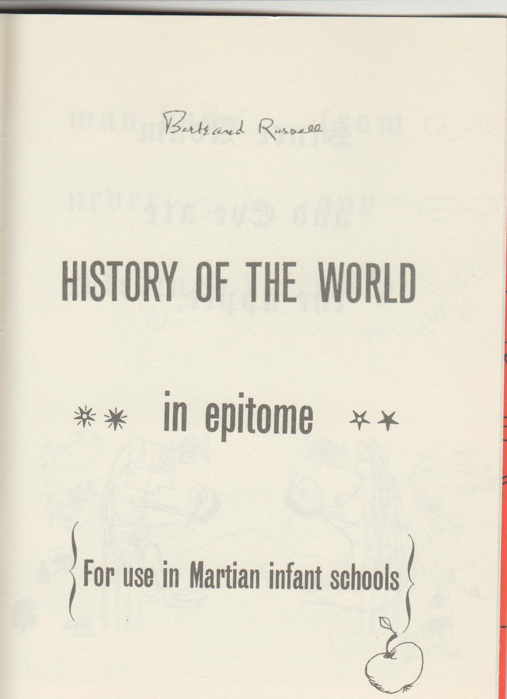
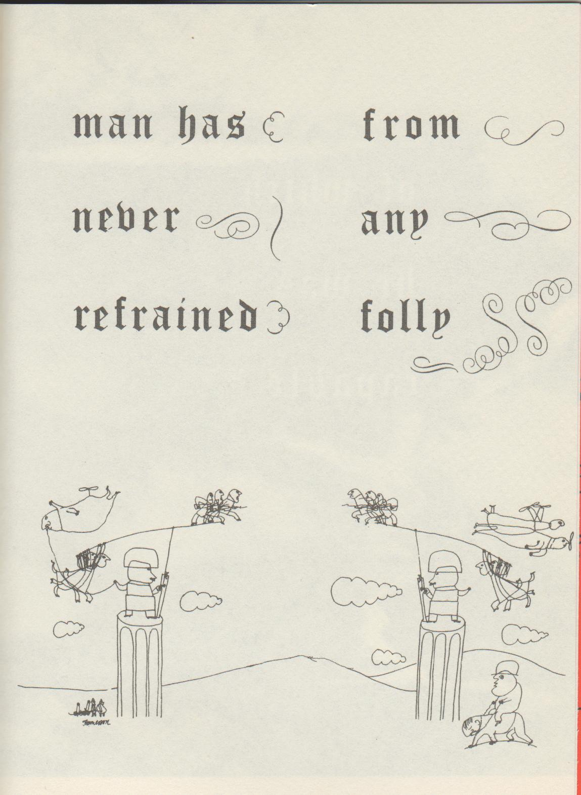

```{r, echo=FALSE}
dd <- read.csv("./GoodCitizen.csv", row.names=1L)
texte <- function(lettre){
  out <- sprintf("<h1><em>%s</em></h1><h3>%s</h3>", 
          dd[lettre,"word_fr"], dd[lettre,"def_fr"])
  if(lettre == "H"){
    out <- paste0(out, "</br></br></br>", texte("I"))
  }
  if(lettre == "Q"){
    out <- paste0(out, "</br></br></br>", texte("R"))
  }
  out
}
slide <- function(lettre, suffix=lettre){
  cat(sprintf('
<div class="slide">
</br>
<div class="picture" style="float:left;width:47%%">

</div>
<div class="definition" style="float:right;width:47%%">
%s
</div>
<div style="clear:both;">
</div>
</div>
', suffix, texte(lettre)))  
}
```

<style type="text/css">
h3 { 
font-family: "Open Sans Condensed";
font-weight: normal;
}
.epitome.picture img {
width: 90%
}
.epitome {
font-size: 23px;
}
#slick .slick-prev {
position:absolute;
top:65px;	
left:-50px;
}
#slick .slick-next {
position:absolute;
top:95px;	
left:-50px;
}
.slick-prev::before, .slick-next::before { 
color:red !important;
font-size: 30px !important;
}
#slickcontainer {
margin: auto;
padding: 2px;
width: 90%;
}
</style>


<div id="slickcontainer">
<div id="slick">

<div class="slide">

</div>

<div class="slide">
</br>

Le 13 décembre 1952, Bertrand Russell adressait son manuscrit de *L'Alphabet du bon citoyen* à Stefan Themerson : *"Ce que je vous envoie n'a pas d'autre but que l'amusement. J'imagine déjà les charmantes illustrations que pourrait dessiner Mrs Themerson."*

L'éditeur, enthousiasmé, commença à en programmer la publication pour le printemps suivant, et demanda à Russell quelles étaient ses conditions. *"Vous me demandez mes conditions, répondit le philosophe, je comptais vous offrir mon alphabet pour Noël. Si cela vous convient, j'aime autant qu'il en soit ainsi. Je me garderais bien de réclamer des droits d'auteur sur ce qui risque de ne pas être une affaire très rentable."*
</div>

<div class="slide">

</div>

<div class="slide">
## Préface

Le présent volume a pour vocation de combler une lacune dont notre système éducatif est entaché de longue date. Les personnes ayant la plus grande expérience des toutes premières étapes du processus pédagogique ont été obligées de conclure que, dans de très nombreux cas, beaucoup de complications inutiles et d'heures de cours gaspillées, alors qu'on aurait pu l'éviter, s'expliquaient par le fait que l'ABC, cette clé de toute sagesse, n'était pas présenté d'une manière assez attrayante pour les esprits immatures à qui nous avons malheureusement le devoir de nous adresser. Cet ouvrage, si restreinte en soit l'étendue et si modeste en soit la visée, répond exactement, nous le croyons et nous l'espérons, au besoin d'édification de l'esprit d'un enfant au stade de l'éveil, confronté aux dangers de notre époque. Ce que nous avançons repose sur des preuves concrètes. Nous avons essayé notre alphabet sur de nombreux sujets. Certains l'ont jugé sage, d'autres stupide. Certains l'ont considéré honnête, d'autres ont pu le trouver subversif. Mais - nous le disons avec la confiance la plus complète et la plus absolue - tous ceux à qui nous avons montré ce livre ont eu, depuis lors, une connaissance impeccable de l'alphabet. C'est pourquoi nous sommes convaincus que, dès la seconde où elles prendront connaissance de cet ouvrage, nos autorités éducatives donneront immédiatement l'ordre de l'adopter dans toutes les institutions scolaires où sont inculqués les premiers éléments d'alphabétisation.

<div align="right" style="font-size:20px"><em>17 janvier 1953, B.R.</em></div>
</div>

```{r, echo=FALSE, results='asis'}
for(letter in LETTERS[1:7]){
  slide(letter)
}
```

```{r, echo=FALSE, results='asis'}
slide("H", suffix="HI")
#cat("</br></br></br>")
#cat(texte("I"))
```

```{r, echo=FALSE, results='asis'}
for(letter in LETTERS[10:16]){
  slide(letter)
}
```

```{r, echo=FALSE, results='asis'}
slide("Q", suffix="QR")
#cat("</br></br></br>")
#cat(texte("R"))
```

```{r, echo=FALSE, results='asis'}
for(letter in LETTERS[19:26]){
  slide(letter)
}
```

<div class="slide">
</br>
<div class="picture epitome" style="float:left;width:47%">
 
</div>
<div class="epitome" style="float:right;width:47%;text-align:center">
</br>
<span style="font-size:29px;margin-left:auto;margin-right:auto;text-align:center">**ABRÉGÉ DE L'HISTOIRE DU MONDE**</span>
</br>
<p style="margin-left:auto;margin-right:auto;text-align:center">À l'usage des écoliers de la planète Mars</p>
</div>
<div style="clear:both"></div>
</div>

<div class="slide">
</br>
<div class="picture epitome" style="float:left;width:47%">
 
</div>
<div class="epitome" style="float:right;width:47%">
</br>
Depuis qu'Adam et Ève ont mangé la pomme,
</div>
<div style="clear:both"></div>
</div>

<div class="slide">
</br>
<div class="picture epitome" style="float:left;width:47%">
 
</div>
<div class="epitome" style="float:right;width:47%">
</br>
jamais l'homme n'a réfréné la folie
</div>
<div style="clear:both"></div>
</div>

<div class="slide">
</br>
<div class="picture epitome" style="float:left;width:47%">
 
</div>
<div class="epitome" style="float:right;width:47%">
</br>
dont il est capable.
</div>
<div style="clear:both"></div>
</div>


<div class="slide">

</div>

</div>
</div>

<link rel="stylesheet" href="../libraries/slick/slick-theme.css" type="text/css"/>
<link rel="stylesheet" href="../libraries/slick/slick.css" type="text/css"/>
<script src="../libraries/slick/slick.min.js"></script>
<script>
$("#slick").slick({
arrows: true,
dots: false,
slidesToShow: 1,
slidesToScroll: 1,
centerMode: false});
</script>