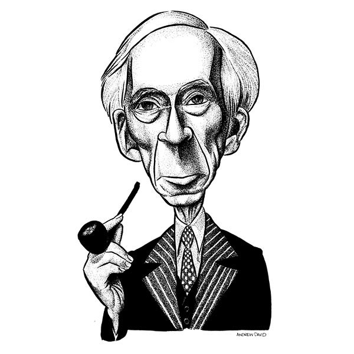
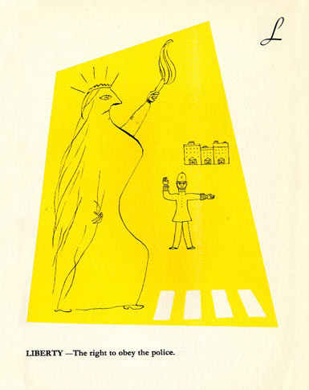
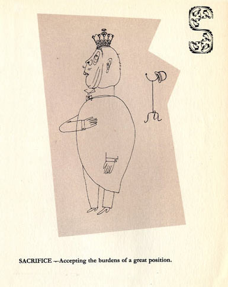
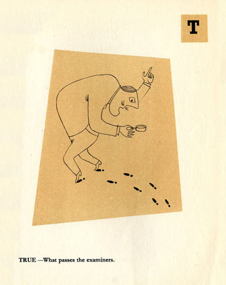
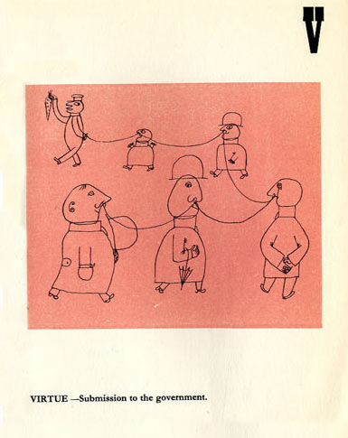
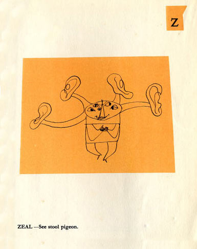

::: {#slickcontainer}
::: {#slick}
::: {.slide}

:::

::: {.slide}
 

Le 13 décembre 1952, Bertrand Russell adressait son manuscrit de
*L'Alphabet du bon citoyen* à Stefan Themerson : *"Ce que je vous envoie
n'a pas d'autre but que l'amusement. J'imagine déjà les charmantes
illustrations que pourrait dessiner Mrs Themerson."*

L'éditeur, enthousiasmé, commença à en programmer la publication pour le
printemps suivant, et demanda à Russell quelles étaient ses conditions.
*"Vous me demandez mes conditions, répondit le philosophe, je comptais
vous offrir mon alphabet pour Noël. Si cela vous convient, j'aime autant
qu'il en soit ainsi. Je me garderais bien de réclamer des droits
d'auteur sur ce qui risque de ne pas être une affaire très rentable."*
:::

::: {.slide}

:::

::: {.slide}
Préface
-------

Le présent volume a pour vocation de combler une lacune dont notre
système éducatif est entaché de longue date. Les personnes ayant la plus
grande expérience des toutes premières étapes du processus pédagogique
ont été obligées de conclure que, dans de très nombreux cas, beaucoup de
complications inutiles et d'heures de cours gaspillées, alors qu'on
aurait pu l'éviter, s'expliquaient par le fait que l'ABC, cette clé de
toute sagesse, n'était pas présenté d'une manière assez attrayante pour
les esprits immatures à qui nous avons malheureusement le devoir de nous
adresser. Cet ouvrage, si restreinte en soit l'étendue et si modeste en
soit la visée, répond exactement, nous le croyons et nous l'espérons, au
besoin d'édification de l'esprit d'un enfant au stade de l'éveil,
confronté aux dangers de notre époque. Ce que nous avançons repose sur
des preuves concrètes. Nous avons essayé notre alphabet sur de nombreux
sujets. Certains l'ont jugé sage, d'autres stupide. Certains l'ont
considéré honnête, d'autres ont pu le trouver subversif. Mais - nous le
disons avec la confiance la plus complète et la plus absolue - tous ceux
à qui nous avons montré ce livre ont eu, depuis lors, une connaissance
impeccable de l'alphabet. C'est pourquoi nous sommes convaincus que, dès
la seconde où elles prendront connaissance de cet ouvrage, nos autorités
éducatives donneront immédiatement l'ordre de l'adopter dans toutes les
institutions scolaires où sont inculqués les premiers éléments
d'alphabétisation.

::: {align="right" style="font-size:20px"}
<em>17 janvier 1953, B.R.</em>
:::
:::

::: {.slide}
 

::: {.picture style="float:left;width:47%"}

:::

::: {.definition style="float:right;width:47%"}
<h1>
<em>Ânerie</em>
</h1>
<h3>
Ce que *vous* pensez.
</h3>
:::

::: {style="clear:both;"}
:::
:::

::: {.slide}
 

::: {.picture style="float:left;width:47%"}

:::

::: {.definition style="float:right;width:47%"}
<h1>
<em>Bolchévique</em>
</h1>
<h3>
Quiconque a une opinion différente de la mienne.
</h3>
:::

::: {style="clear:both;"}
:::
:::

::: {.slide}
 

::: {.picture style="float:left;width:47%"}

:::

::: {.definition style="float:right;width:47%"}
<h1>
<em>Chrétien</em>
</h1>
<h3>
Contraire aux Évangiles.
</h3>
:::

::: {style="clear:both;"}
:::
:::

::: {.slide}
 

::: {.picture style="float:left;width:47%"}

:::

::: {.definition style="float:right;width:47%"}
<h1>
<em>Diabolique</em>
</h1>
<h3>
Susceptible de moins enrichir les nantis.
</h3>
:::

::: {style="clear:both;"}
:::
:::

::: {.slide}
 

::: {.picture style="float:left;width:47%"}

:::

::: {.definition style="float:right;width:47%"}
<h1>
<em>Erroné</em>
</h1>
<h3>
Ce qui peut être démontré comme vrai.
</h3>
:::

::: {style="clear:both;"}
:::
:::

::: {.slide}
 

::: {.picture style="float:left;width:47%"}

:::

::: {.definition style="float:right;width:47%"}
<h1>
<em>Fou</em>
</h1>
<h3>
Détesté par la police.
</h3>
:::

::: {style="clear:both;"}
:::
:::

::: {.slide}
 

::: {.picture style="float:left;width:47%"}

:::

::: {.definition style="float:right;width:47%"}
<h1>
<em>Envieux</em>
</h1>
<h3>
Vouloir quelque chose que je possède et que vous n'avez pas.
</h3>
:::

::: {style="clear:both;"}
:::
:::

::: {.slide}
 

::: {.picture style="float:left;width:47%"}

:::

::: {.definition style="float:right;width:47%"}
<h1>
<em>Sacré</em>
</h1>
<h3>
Perpétué par des idiots depuis des siècles. Voir : Ignorant.
</h3>
   
<h1>
<em>Ignorant</em>
</h1>
<h3>
Pas sacré.
</h3>
:::

::: {style="clear:both;"}
:::
:::

::: {.slide}
 

::: {.picture style="float:left;width:47%"}

:::

::: {.definition style="float:right;width:47%"}
<h1>
<em>Joyeux</em>
</h1>
<h3>
Le déclin de nos ennemis.
</h3>
:::

::: {style="clear:both;"}
:::
:::

::: {.slide}
 

::: {.picture style="float:left;width:47%"}

:::

::: {.definition style="float:right;width:47%"}
<h1>
<em>Connaissance</em>
</h1>
<h3>
Ce qui est certain pour les Archevêques.
</h3>
:::

::: {style="clear:both;"}
:::
:::

::: {.slide}
 

::: {.picture style="float:left;width:47%"}

:::

::: {.definition style="float:right;width:47%"}
<h1>
<em>Liberté</em>
</h1>
<h3>
Le droit d'obéir à la police.
</h3>
:::

::: {style="clear:both;"}
:::
:::

::: {.slide}
 

::: {.picture style="float:left;width:47%"}

:::

::: {.definition style="float:right;width:47%"}
<h1>
<em>Mystère</em>
</h1>
<h3>
Ce que moi je comprends et pas vous.
</h3>
:::

::: {style="clear:both;"}
:::
:::

::: {.slide}
 

::: {.picture style="float:left;width:47%"}

:::

::: {.definition style="float:right;width:47%"}
<h1>
<em>Nigaud</em>
</h1>
<h3>
Quelqu'un qui sert l'humanité d'une façon qui ne lui vaut aucune
reconnaissance.
</h3>
:::

::: {style="clear:both;"}
:::
:::

::: {.slide}
 

::: {.picture style="float:left;width:47%"}

:::

::: {.definition style="float:right;width:47%"}
<h1>
<em>Objectif</em>
</h1>
<h3>
Une illusion partagée avec d'autres fous.
</h3>
:::

::: {style="clear:both;"}
:::
:::

::: {.slide}
 

::: {.picture style="float:left;width:47%"}

:::

::: {.definition style="float:right;width:47%"}
<h1>
<em>Pédant</em>
</h1>
<h3>
Un homme attaché à ce que ses affirmations soient justes.
</h3>
:::

::: {style="clear:both;"}
:::
:::

::: {.slide}
 

::: {.picture style="float:left;width:47%"}

:::

::: {.definition style="float:right;width:47%"}
<h1>
<em>Bizarre</em>
</h1>
<h3>
Fonder son opinion sur des faits.
</h3>
   
<h1>
<em>Rationnel</em>
</h1>
<h3>
Ne pas fonder son opinion sur des faits.
</h3>
:::

::: {style="clear:both;"}
:::
:::

::: {.slide}
 

::: {.picture style="float:left;width:47%"}

:::

::: {.definition style="float:right;width:47%"}
<h1>
<em>Sacrifice</em>
</h1>
<h3>
Accepter le fardeau d'une haute situation.
</h3>
:::

::: {style="clear:both;"}
:::
:::

::: {.slide}
 

::: {.picture style="float:left;width:47%"}

:::

::: {.definition style="float:right;width:47%"}
<h1>
<em>Vrai</em>
</h1>
<h3>
Ce que l'examen atteste.
</h3>
:::

::: {style="clear:both;"}
:::
:::

::: {.slide}
 

::: {.picture style="float:left;width:47%"}

:::

::: {.definition style="float:right;width:47%"}
<h1>
<em>Injuste</em>
</h1>
<h3>
Avantageux pour la partie adverse.
</h3>
:::

::: {style="clear:both;"}
:::
:::

::: {.slide}
 

::: {.picture style="float:left;width:47%"}

:::

::: {.definition style="float:right;width:47%"}
<h1>
<em>Vertu</em>
</h1>
<h3>
Soumission au gouvernement.
</h3>
:::

::: {style="clear:both;"}
:::
:::

::: {.slide}
 

::: {.picture style="float:left;width:47%"}

:::

::: {.definition style="float:right;width:47%"}
<h1>
<em>Sagesse</em>
</h1>
<h3>
Les opinions de nos ancêtres.
</h3>
:::

::: {style="clear:both;"}
:::
:::

::: {.slide}
 

::: {.picture style="float:left;width:47%"}

:::

::: {.definition style="float:right;width:47%"}
<h1>
<em>Xénophobie</em>
</h1>
<h3>
Conviction des Andorrans selon laquelle les habitants d'Andorre sont les
meilleurs.
</h3>
:::

::: {style="clear:both;"}
:::
:::

::: {.slide}
 

::: {.picture style="float:left;width:47%"}

:::

::: {.definition style="float:right;width:47%"}
<h1>
<em>Jeunesse</em>
</h1>
<h3>
Effet du dynamisme sur les personnes âgées.
</h3>
:::

::: {style="clear:both;"}
:::
:::

::: {.slide}
 

::: {.picture style="float:left;width:47%"}

:::

::: {.definition style="float:right;width:47%"}
<h1>
<em>Zèle</em>
</h1>
<h3>
Voir mouchard.
</h3>
:::

::: {style="clear:both;"}
:::
:::

::: {.slide}
 

::: {.picture .epitome style="float:left;width:47%"}

:::

::: {.epitome style="float:right;width:47%;text-align:center"}
  [**ABRÉGÉ DE L'HISTOIRE DU
MONDE**]{style="font-size:29px;margin-left:auto;margin-right:auto;text-align:center"}
 

À l'usage des écoliers de la planète Mars

:::

::: {style="clear:both"}
:::
:::

::: {.slide}
 

::: {.picture .epitome style="float:left;width:47%"}

:::

::: {.epitome style="float:right;width:47%"}
  Depuis qu'Adam et Ève ont mangé la pomme,
:::

::: {style="clear:both"}
:::
:::

::: {.slide}
 

::: {.picture .epitome style="float:left;width:47%"}

:::

::: {.epitome style="float:right;width:47%"}
  jamais l'homme n'a réfréné la folie
:::

::: {style="clear:both"}
:::
:::

::: {.slide}
 

::: {.picture .epitome style="float:left;width:47%"}

:::

::: {.epitome style="float:right;width:47%"}
  dont il est capable.
:::

::: {style="clear:both"}
:::
:::

::: {.slide}

:::
:::
:::

<link rel="stylesheet" href="../libraries/slick/slick-theme.css" type="text/css"/>
<link rel="stylesheet" href="../libraries/slick/slick.css" type="text/css"/>

